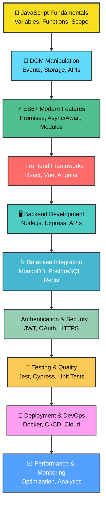
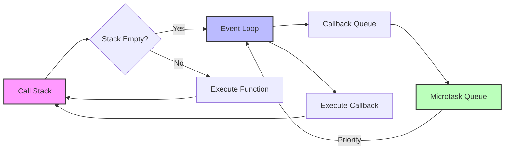
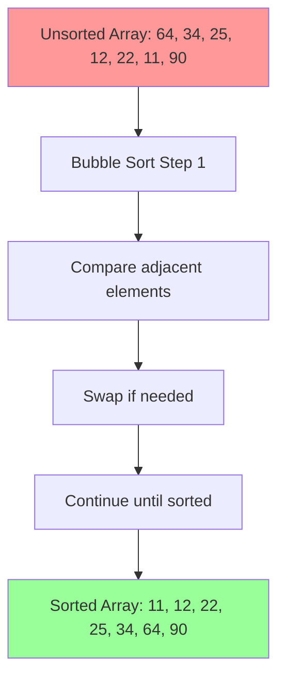
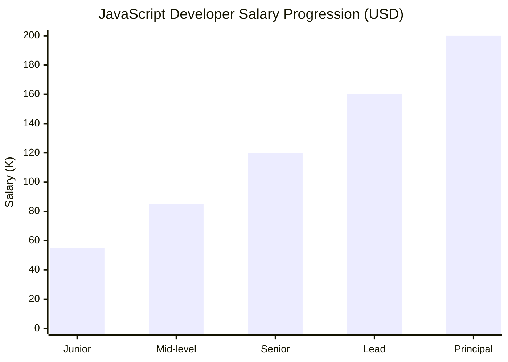
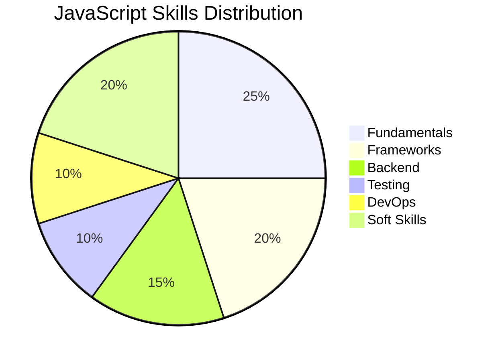

<div align="center">

# 🌟 JavaScript Mastery Roadmap 2025


<br>


[](https://javascript.info/)
[](https://nodejs.org/)
[](https://reactjs.org/)
[](https://vuejs.org/)
[](https://typescriptlang.org/)

<br>


<h3>🚀 Your Ultimate Guide to JavaScript Mastery</h3>
<p><i>From fundamentals to full-stack development - everything you need to become a JavaScript expert</i></p>

[🎯 Start Journey](#-interactive-roadmap) • [📚 Resources](#-curated-resources) • [🛠️ Projects](#-hands-on-projects) • [💼 Career](#-career-path) • [🏆 Challenges](#-coding-challenges)

</div>

---

## 🎯 Interactive Roadmap

<div align="center">



</div>

<div align="center">

</div>

---

## 📊 Learning Progress Tracker

<div align="center">

| Phase | Duration | Difficulty | Progress |
|-------|----------|------------|----------|
| 🎯 **JavaScript Basics** | 4-6 weeks | 🟢 Beginner |  |
| ⚡ **Modern ES6+** | 3-4 weeks | 🟡 Intermediate |  |
| 🎨 **Frontend Frameworks** | 8-10 weeks | 🟠 Advanced |  |
| 🖥️ **Backend Development** | 6-8 weeks | 🔴 Expert |  |
| 🚀 **Production Ready** | 4-6 weeks | ⚫ Master |  |

</div>

---

## 🎨 Visual Learning Path

<div align="center">

</div>

### 🌟 Phase 1: Foundation Building

<details>
<summary><b>🎯 JavaScript Fundamentals (Weeks 1-6)</b></summary>

<div align="center">

</div>

#### Week 1-2: Core Concepts
```javascript
// 🎯 Variables & Data Types
let message = "Hello JavaScript!";
const PI = 3.14159;
var isLearning = true;

// 🎯 Functions Revolution
const greet = (name) => `Welcome ${name}! 🚀`;
const calculate = (a, b, operation) => {
  const operations = {
    add: () => a + b,
    multiply: () => a * b,
    power: () => Math.pow(a, b)
  };
  return operations[operation]?.() || "Invalid operation";
};
```

#### Week 3-4: Control Flow & Arrays
```javascript
// 🎯 Modern Array Methods
const numbers = [1, 2, 3, 4, 5];
const processed = numbers
  .filter(n => n % 2 === 0)        // [2, 4]
  .map(n => n * n)                 // [4, 16]
  .reduce((sum, n) => sum + n, 0); // 20

// 🎯 Object Destructuring Magic
const user = { name: "Alice", age: 25, city: "NYC" };
const { name, ...rest } = user;
console.log(`${name} lives in ${rest.city}`);
```

#### Week 5-6: DOM Mastery
```javascript
// 🎯 Modern DOM Manipulation
const createCard = (data) => {
  const card = document.createElement('div');
  card.className = 'card animate-fadeIn';
  card.innerHTML = `
    <h3>${data.title}</h3>
    <p>${data.description}</p>
    <button onclick="handleClick('${data.id}')">Action</button>
  `;
  return card;
};

// 🎯 Event Delegation
document.addEventListener('click', (e) => {
  if (e.target.matches('.card button')) {
    animateCard(e.target.closest('.card'));
  }
});
```

</details>

### ⚡ Phase 2: Modern JavaScript

<details>
<summary><b>⚡ ES6+ Features & Async Programming (Weeks 7-11)</b></summary>

<div align="center">

</div>

#### Advanced Features Showcase
```javascript
// 🎯 Async/Await Mastery
const fetchUserData = async (userId) => {
  try {
    const [user, posts, followers] = await Promise.all([
      fetch(`/api/users/${userId}`).then(r => r.json()),
      fetch(`/api/posts?userId=${userId}`).then(r => r.json()),
      fetch(`/api/followers/${userId}`).then(r => r.json())
    ]);
    
    return { user, posts, followers };
  } catch (error) {
    console.error('💥 Error fetching data:', error);
    throw new Error('Failed to load user data');
  }
};

// 🎯 Modern Class Syntax
class DataManager {
  #privateData = new Map();
  
  constructor(config) {
    this.config = { timeout: 5000, ...config };
  }
  
  async #authenticate() {
    // Private method implementation
  }
  
  get stats() {
    return {
      entries: this.#privateData.size,
      lastUpdate: this.lastModified
    };
  }
}
```

</details>

### 🎨 Phase 3: Frontend Frameworks

<details>
<summary><b>🎨 React, Vue & Modern Frontend (Weeks 12-22)</b></summary>

<div align="center">

</div>

#### React Hooks Mastery
```jsx
// 🎯 Custom Hooks
const useLocalStorage = (key, initialValue) => {
  const [storedValue, setStoredValue] = useState(() => {
    try {
      const item = window.localStorage.getItem(key);
      return item ? JSON.parse(item) : initialValue;
    } catch (error) {
      return initialValue;
    }
  });

  const setValue = (value) => {
    try {
      setStoredValue(value);
      window.localStorage.setItem(key, JSON.stringify(value));
    } catch (error) {
      console.error('Error saving to localStorage:', error);
    }
  };

  return [storedValue, setValue];
};

// 🎯 Component with Suspense
const UserProfile = ({ userId }) => {
  const user = useSWR(`/api/users/${userId}`, fetcher, {
    suspense: true,
    revalidateOnFocus: false
  });

  return (
    <div className="profile-card">
      
      <h2>{user.name}</h2>
      <p>{user.bio}</p>
    </div>
  );
};
```

</details>

---

## 🛠️ Hands-on Projects

<div align="center">

</div>

### 🚀 Project Showcase

| Project | Level | Tech Stack | Live Demo | Source |
|---------|-------|------------|-----------|---------|
| 🎮 **Interactive Game Hub** | 🟢 Beginner | `HTML` `CSS` `JS` | [🔗 Demo](https://js-game-hub.netlify.app) | [📁 Code](./projects/game-hub) |
| 🌤️ **Weather Dashboard** | 🟡 Intermediate | `React` `API` `Charts` | [🔗 Demo](https://weather-dash.vercel.app) | [📁 Code](./projects/weather-app) |
| 💬 **Real-time Chat App** | 🟠 Advanced | `Node.js` `Socket.io` `MongoDB` | [🔗 Demo](https://chat-app-demo.herokuapp.com) | [📁 Code](./projects/chat-app) |
| 🛒 **E-commerce Platform** | 🔴 Expert | `Next.js` `Stripe` `PostgreSQL` | [🔗 Demo](https://shop-demo.vercel.app) | [📁 Code](./projects/ecommerce) |

<div align="center">

### 🎯 Project Ideas by Category

<table>
<tr>
<td width="50%">

#### 🎮 **Interactive & Fun**
- 🎲 Dice Rolling Simulator
- 🎯 Memory Card Game
- 🎵 Music Player
- 🎨 Drawing Canvas
- 🎪 Animation Showcase
- 🎰 Slot Machine
- 🧩 Puzzle Games
- 🎮 2D Platformer

</td>
<td width="50%">

#### 💼 **Business & Productivity**
- 📊 Analytics Dashboard
- 💰 Expense Tracker
- 📅 Calendar App
- 📝 Note Taking App
- 🏃‍♂️ Habit Tracker
- 💳 Invoice Generator
- 📈 Stock Portfolio
- 🏢 CRM System

</td>
</tr>
<tr>
<td width="50%">

#### 🌐 **Social & Communication**
- 💬 Chat Application
- 📱 Social Media Feed
- 🎥 Video Calling App
- 📧 Email Client
- 🗳️ Polling App
- 👥 Team Collaboration
- 📰 News Aggregator
- 🎭 Forum Platform

</td>
<td width="50%">

#### 🔧 **Developer Tools**
- 🎨 Code Editor
- 🔍 API Testing Tool
- 📊 Performance Monitor
- 🎯 Regex Tester
- 🎨 Color Palette Generator
- 📏 Unit Converter
- 🎭 Mock Data Generator
- 🔐 Password Manager

</td>
</tr>
</table>

</div>

---

## 📚 Curated Resources

<div align="center">

</div>

### 🎥 Premium Video Content

<div align="center">

| Resource | Platform | Duration | Rating | Free |
|----------|----------|----------|--------|------|
| [🎯 JavaScript Crash Course](https://www.youtube.com/watch?v=hdI2bqOjy3c) | YouTube | 1.5h | ⭐⭐⭐⭐⭐ | ✅ |
| [⚡ Modern JavaScript](https://www.youtube.com/watch?v=2qDywOS7VAc) | YouTube | 6h | ⭐⭐⭐⭐⭐ | ✅ |
| [🎨 JavaScript30](https://javascript30.com/) | Wes Bos | 30 days | ⭐⭐⭐⭐⭐ | ✅ |
| [🚀 Node.js Complete Guide](https://www.youtube.com/watch?v=fBNz5xF-Kx4) | YouTube | 12h | ⭐⭐⭐⭐⭐ | ✅ |
| [⚛️ React Complete Course](https://www.youtube.com/watch?v=bMknfKXIFA8) | YouTube | 10h | ⭐⭐⭐⭐⭐ | ✅ |

</div>

### 📖 Essential Reading Material

<details>
<summary><b>📚 Must-Read Books (Click to expand)</b></summary>

#### 🏆 **Beginner Friendly**
- 📘 [**Eloquent JavaScript**](https://eloquentjavascript.net/) - *Marijn Haverbeke*
  - 🎯 Perfect for beginners
  - 💡 Interactive examples
  - 🆓 Completely free online

- 📗 [**You Don't Know JS**](https://github.com/getify/You-Dont-Know-JS) - *Kyle Simpson*
  - 🎯 Deep dive into JS concepts
  - 💡 6-book series
  - 🆓 Open source

#### 🚀 **Advanced Level**
- 📙 [**JavaScript: The Good Parts**](https://www.oreilly.com/library/view/javascript-the-good/9780596517748/) - *Douglas Crockford*
- 📕 [**Secrets of the JavaScript Ninja**](https://www.manning.com/books/secrets-of-the-javascript-ninja-second-edition) - *John Resig*

</details>

### 🌟 Interactive Platforms

<div align="center">

[](https://www.freecodecamp.org/learn/javascript-algorithms-and-data-structures/)
[](https://www.codecademy.com/learn/introduction-to-javascript)
[](https://developer.mozilla.org/en-US/docs/Web/JavaScript)
[](https://javascript.info/)

</div>

---

## 💡 Advanced Concepts Visualized

<div align="center">

</div>

### 🧠 JavaScript Event Loop



### 🔄 Prototype Chain Visualization

```javascript
// 🎯 Understanding Prototypes
function Animal(name) {
  this.name = name;
}

Animal.prototype.speak = function() {
  return `${this.name} makes a sound`;
};

function Dog(name, breed) {
  Animal.call(this, name);
  this.breed = breed;
}

// 🔗 Prototype Chain
Dog.prototype = Object.create(Animal.prototype);
Dog.prototype.constructor = Dog;
Dog.prototype.bark = function() {
  return `${this.name} barks!`;
};

const myDog = new Dog("Buddy", "Golden Retriever");
console.log(myDog.speak()); // Inherited from Animal
console.log(myDog.bark());  // Own method
```

---

## 🏆 Coding Challenges

<div align="center">

</div>

### 🎯 Daily Challenge Calendar

<details>
<summary><b>🗓️ 30-Day JavaScript Challenge</b></summary>

#### Week 1: Foundation Building 🏗️
| Day | Challenge | Difficulty | Solution |
|-----|-----------|------------|----------|
| 1 | **Two Sum** | 🟢 Easy | [💡 View](./challenges/day01.js) |
| 2 | **Reverse String** | 🟢 Easy | [💡 View](./challenges/day02.js) |
| 3 | **Palindrome Check** | 🟢 Easy | [💡 View](./challenges/day03.js) |
| 4 | **FizzBuzz** | 🟢 Easy | [💡 View](./challenges/day04.js) |
| 5 | **Factorial** | 🟡 Medium | [💡 View](./challenges/day05.js) |
| 6 | **Prime Numbers** | 🟡 Medium | [💡 View](./challenges/day06.js) |
| 7 | **Array Chunking** | 🟡 Medium | [💡 View](./challenges/day07.js) |

#### Week 2: Data Structures 📊
| Day | Challenge | Difficulty | Solution |
|-----|-----------|------------|----------|
| 8 | **Valid Parentheses** | 🟡 Medium | [💡 View](./challenges/day08.js) |
| 9 | **Binary Search** | 🟡 Medium | [💡 View](./challenges/day09.js) |
| 10 | **Merge Sort** | 🟠 Hard | [💡 View](./challenges/day10.js) |
| 11 | **Quick Sort** | 🟠 Hard | [💡 View](./challenges/day11.js) |
| 12 | **Linked List** | 🟠 Hard | [💡 View](./challenges/day12.js) |
| 13 | **Binary Tree** | 🟠 Hard | [💡 View](./challenges/day13.js) |
| 14 | **Graph Traversal** | 🔴 Expert | [💡 View](./challenges/day14.js) |

</details>

### 🧩 Algorithm Visualizations

<div align="center">



</div>

---

## 💼 Career Path

<div align="center">

</div>

### 📈 Salary Progression Chart



<div align="center">

### 🎯 Career Tracks

<table>
<tr>
<td width="33%">

#### 🎨 **Frontend Specialist**
- 🎯 UI/UX Focus
- ⚛️ React/Vue Expert
- 🎨 CSS Wizard
- 📱 Mobile Development
- 💰 $60k - $140k

</td>
<td width="33%">

#### 🔧 **Full-Stack Developer**
- 🖥️ Frontend + Backend
- 🗄️ Database Design
- 🔐 Security Expert
- ☁️ Cloud Architecture
- 💰 $70k - $160k

</td>
<td width="33%">

#### 🏗️ **JavaScript Architect**
- 🎯 Technical Leadership
- 🏗️ System Design
- 👥 Team Management
- 📊 Performance Optimization
- 💰 $120k - $200k+

</td>
</tr>
</table>

</div>

### 🌟 Skills Roadmap Matrix

<div align="center">

| Skill Category | Junior | Mid-Level | Senior | Lead |
|---------------|--------|-----------|---------|------|
| **JavaScript Core** |  |  |  |  |
| **Frameworks** |  |  |  |  |
| **Backend** |  |  |  |  |
| **DevOps** |  |  |  |  |
| **Leadership** |  |  |  |  |

</div>

---

## 🎭 Interview Preparation

<div align="center">

</div>

### 🔥 Top Interview Questions

<details>
<summary><b>⚡ Technical Deep Dive Questions</b></summary>

#### 🎯 **JavaScript Fundamentals**

**Q1: Explain the difference between `==` and `===`**
```javascript
// Type coercion with ==
console.log(5 == "5");   // true (string converted to number)
console.log(null == undefined); // true
console.log(0 == false); // true

// Strict equality with ===
console.log(5 === "5");   // false (different types)
console.log(null === undefined); // false
console.log(0 === false); // false

// Best Practice: Always use === unless you specifically need type coercion
```

**Q2: What is the Event Loop?**
```javascript
console.log("1"); // Synchronous

setTimeout(() => {
  console.log("2"); // Macrotask
}, 0);

Promise.resolve().then(() => {
  console.log("3"); // Microtask
});

console.log("4"); // Synchronous

// Output: 1, 4, 3, 2
// Microtasks have higher priority than macrotasks
```

**Q3: Implement a debounce function**
```javascript
function debounce(func, wait, immediate) {
  let timeout;
  
  return function executedFunction(...args) {
    const later = () => {
      timeout = null;
      if (!immediate) func.apply(this, args);
    };
    
    const callNow = immediate && !timeout;
    clearTimeout(timeout);
    timeout = setTimeout(later, wait);
    
    if (callNow) func.apply(this, args);
  };
}

// Usage
const debouncedSearch = debounce((query) => {
  console.log("Searching for:", query);
}, 300);
```

</details>

<details>
<summary><b>🧠 Problem Solving Challenges</b></summary>

#### 🎯 **Algorithm Implementation**

**Challenge 1: Flatten Nested Array**
```javascript
// Multiple approaches to flatten arrays
function flattenArray(arr) {
  // Method 1: Recursion
  const result = [];
  for (let item of arr) {
    if (Array.isArray(item)) {
      result.push(...flattenArray(item));
    } else {
      result.push(item);
    }
  }
  return result;
}

// Method 2: Built-in flat()
const flattened = arr.flat(Infinity);

// Method 3: Reduce
const flattenReduce = arr => arr.reduce(
  (acc, val) => acc.concat(Array.isArray(val) ? flattenReduce(val) : val), []
);
```

**Challenge 2: Deep Clone Object**
```javascript
function deepClone(obj, hash = new WeakMap()) {
  // Handle primitives and null
  if (obj === null || typeof obj !== "object") return obj;
  
  // Handle circular references
  if (hash.has(obj)) return hash.get(obj);
  
  // Handle dates
  if (obj instanceof Date) return new Date(obj.getTime());
  
  // Handle arrays
  if (Array.isArray(obj)) {
    const cloned = [];
    hash.set(obj, cloned);
    obj.forEach(item => cloned.push(deepClone(item, hash)));
    return cloned;
  }
  
  // Handle objects
  const cloned = {};
  hash.set(obj, cloned);
  Object.keys(obj).forEach(key => {
    cloned[key] = deepClone(obj[key], hash);
  });
  
  return cloned;
}
```

</details>

### 🎯 Mock Interview Simulator

<div align="center">

| Interview Type | Duration | Questions | Difficulty |
|---------------|----------|-----------|------------|
| 📱 **Phone Screen** | 30 min | 5-7 | 🟢 Basic |
| 💻 **Technical Round** | 60 min | 3-5 | 🟡 Medium |
| 🏗️ **System Design** | 45 min | 1-2 | 🟠 Hard |
| 👥 **Cultural Fit** | 30 min | 8-10 | 🟢 Soft Skills |

</div>

---

## 🛠️ Development Environment

<div align="center">

</div>

### ⚡ Quick Setup Guide

```bash
# 🚀 Node.js & Package Managers
curl -o- https://raw.githubusercontent.com/nvm-sh/nvm/v0.39.7/install.sh | bash
nvm install --lts
npm install -g yarn pnpm

# 🔧 Essential Global Tools
npm install -g @vue/cli create-react-app @angular/cli
npm install -g nodemon live-server http-server
npm install -g eslint prettier typescript

# 🧪 Testing & Quality Tools
npm install -g jest cypress @storybook/cli
npm install -g lighthouse @axe-core/cli
```

### 🎨 VS Code Power Setup

<div align="center">

| Extension | Purpose | Rating |
|-----------|---------|--------|
| 🎯 **JavaScript (ES6) snippets** | Code snippets | ⭐⭐⭐⭐⭐ |
| 🎨 **Prettier** | Code formatting | ⭐⭐⭐⭐⭐ |
| 🔍 **ESLint** | Code linting | ⭐⭐⭐⭐⭐ |
| 🌈 **Bracket Pair Colorizer** | Visual aid | ⭐⭐⭐⭐⭐ |
| 🔥 **Live Server** | Local development | ⭐⭐⭐⭐⭐ |
| 🎭 **GitLens** | Git integration | ⭐⭐⭐⭐⭐ |
| 🚀 **Thunder Client** | API testing | ⭐⭐⭐⭐⭐ |
| 🎯 **Auto Rename Tag** | HTML helper | ⭐⭐⭐⭐⭐ |

</div>

---

## 📊 Performance Metrics

<div align="center">

</div>

### 🎯 Code Quality Dashboard

<div align="center">



</div>

### 🚀 Performance Optimization Checklist

<details>
<summary><b>⚡ Core Web Vitals Optimization</b></summary>

#### 🎯 **Largest Contentful Paint (LCP)**
```javascript
// Image optimization
const img = new Image();
img.loading = 'lazy';
img.decoding = 'async';
img.src = 'optimized-image.webp';

// Critical resource hints
const link = document.createElement('link');
link.rel = 'preload';
link.href = 'critical.css';
link.as = 'style';
document.head.appendChild(link);
```

#### 🎯 **First Input Delay (FID)**
```javascript
// Code splitting with dynamic imports
const loadModule = async () => {
  const { heavyFunction } = await import('./heavyModule.js');
  return heavyFunction;
};

// Web Workers for heavy computations
const worker = new Worker('computation.js');
worker.postMessage({ data: largeDataSet });
worker.onmessage = (e) => {
  console.log('Result:', e.data);
};
```

#### 🎯 **Cumulative Layout Shift (CLS)**
```css
/* Reserve space for images */
.image-container {
  aspect-ratio: 16 / 9;
  background: #f0f0f0;
}

/* Stable loading states */
.skeleton {
  background: linear-gradient(90deg, #f0f0f0 25%, #e0e0e0 50%, #f0f0f0 75%);
  background-size: 200% 100%;
  animation: loading 1.5s infinite;
}
```

</details>

---

## 🎨 Modern Design System

<div align="center">

</div>

### 🌈 Color Palette

<div align="center">

| Color | Hex | Usage |
|-------|-----|-------|
| 🟡 **Primary** | `#F7DF1E` | JavaScript branding |
| 🔵 **Secondary** | `#61DAFB` | React elements |
| 🟢 **Success** | `#4CAF50` | Completed tasks |
| 🟠 **Warning** | `#FF9800` | Important notes |
| 🔴 **Error** | `#F44336` | Error states |
| ⚫ **Dark** | `#333333` | Text and borders |

</div>

### 🎭 Animation Library

```css
/* 🎯 Smooth transitions */
.animate-fadeIn {
  animation: fadeIn 0.6s ease-in-out;
}

@keyframes fadeIn {
  from { opacity: 0; transform: translateY(20px); }
  to { opacity: 1; transform: translateY(0); }
}

.animate-slideIn {
  animation: slideIn 0.8s cubic-bezier(0.25, 0.46, 0.45, 0.94);
}

@keyframes slideIn {
  from { transform: translateX(-100%); }
  to { transform: translateX(0); }
}

/* 🎯 Hover effects */
.card:hover {
  transform: translateY(-5px);
  box-shadow: 0 10px 30px rgba(0,0,0,0.1);
  transition: all 0.3s ease;
}
```

---

## 🌟 Community & Support

<div align="center">


### 💬 Join Our Learning Community

[](https://discord.gg/javascript)
[](https://t.me/javascript_roadmap)
[](https://reddit.com/r/javascript)
[](https://stackoverflow.com/questions/tagged/javascript)

</div>

### 🤝 Contributing Guidelines

<details>
<summary><b>🔧 How to Contribute</b></summary>

#### 🎯 **Ways to Contribute**
1. 📝 **Content Creation**
   - Add new project ideas
   - Write tutorials
   - Create code examples
   - Update documentation

2. 🐛 **Issue Reporting**
   - Bug fixes
   - Typo corrections
   - Broken links
   - Outdated information

3. 🌟 **Feature Requests**
   - New sections
   - Tool recommendations
   - Resource additions
   - UI improvements

#### 🚀 **Contribution Process**
```bash
# 1. Fork the repository
gh repo fork deveshpunjabi/JavaScript-Roadmap

# 2. Create feature branch
git checkout -b feature/amazing-addition

# 3. Make changes and commit
git add .
git commit -m "✨ Add amazing new feature"

# 4. Push and create PR
git push origin feature/amazing-addition
gh pr create --title "✨ Amazing new feature"
```

</details>

---

## 📈 Analytics & Tracking

<div align="center">

### 📊 Repository Stats


### 🔥 Contribution Activity


### 🏆 Achievement Badges


</div>

---

## 🎯 Quick Navigation

<div align="center">

| Section | Quick Links |
|---------|-------------|
| 🎯 **Getting Started** | [Roadmap](#-interactive-roadmap) • [Resources](#-curated-resources) • [Setup](#-development-environment) |
| 🛠️ **Practice** | [Projects](#-hands-on-projects) • [Challenges](#-coding-challenges) • [Interview Prep](#-interview-preparation) |
| 💼 **Career** | [Salary Guide](#-career-path) • [Skills Matrix](#-skills-roadmap-matrix) • [Job Hunting](#-modern-design-system) |
| 🤝 **Community** | [Discord](https://discord.gg/javascript) • [Contribute](#-contributing-guidelines) • [Support](#-community--support) |

</div>

---

<div align="center">

## 🚀 Ready to Start Your JavaScript Journey?


### Choose Your Path

[](./beginner-path.md)
[](./intermediate-path.md)
[](./advanced-path.md)

---

### 🌟 Star this repository to keep track of your progress!


---

**Happy Coding! 🎉**

*Made with ❤️ by [Devesh Punjabi](https://github.com/deveshpunjabi)*

[](https://deveshpunjabi.me/)
[](https://linkedin.com/in/deveshpunjabi)
[](https://github.com/deveshpunjabi)

</div>

---

<div align="center">

</div>
